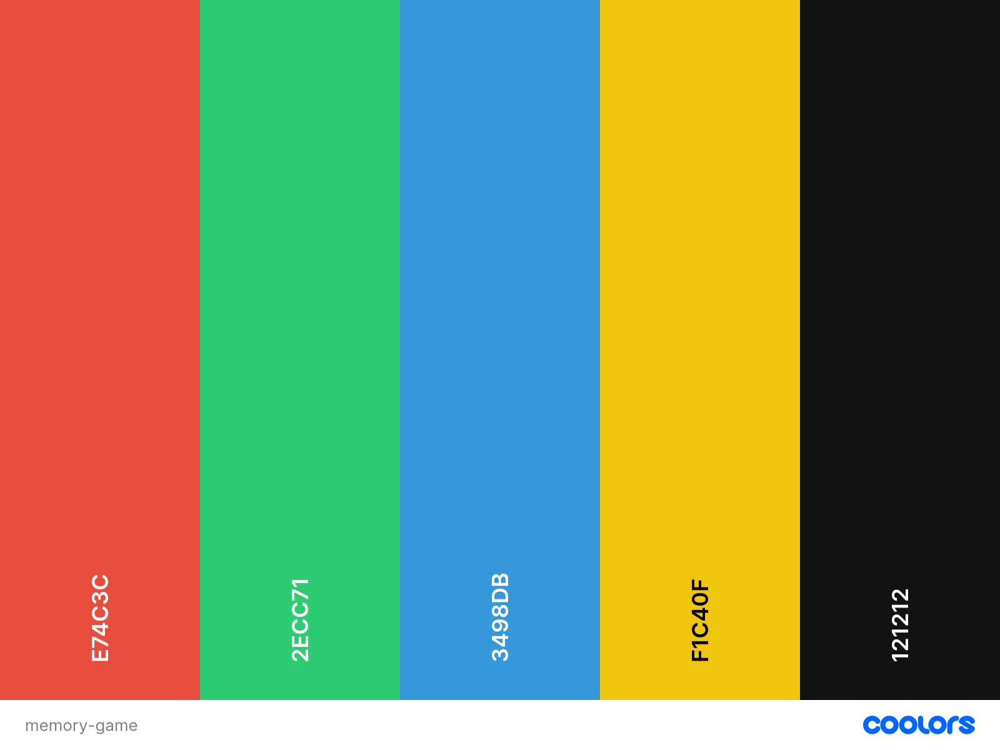

# Memory Game: Watch the pattern, then copy it!

Memory Game is a simple, interactive web game built with HTML, CSS, and JavaScript. It tests how well you can remember and repeat a growing sequence of colours.

When you press Start, one tile will flash. You need to click the same colour. Each round adds a new tile to the sequence, and your goal is to repeat the entire pattern without making a mistake. The game keeps track of your level and your highest score, which is saved automatically in your browser.

The project was designed as part of the Code Institute Interactive Front-End Development module to demonstrate:

Responsive, mobile-first design

DOM manipulation using JavaScript

User interactivity and feedback

Local storage for saving high scores

Clean, readable, beginner-friendly code

---

## Contents

- [User Goals](#user-goals)  
- [User Stories](#user-stories)  
- [Website Goals and Objectives](#website-goals-and-objectives)  
- [Target Audience](#target-audience)  
- [Wireframes](#wireframes)  
- [Design Choices](#design-choices)  
  - [Typography](#typography)  
  - [Colour Scheme](#colour-scheme)  
  - [Images](#images)  
  - [Responsiveness](#responsiveness) 
- [Features](#features)  
  - [Header](#header) 
  - [Main Section](#main-section)
  - [The Game Section](#the-game-section)
  - [The Score Section](#the-score-section)
  - [Footer](#footer) 
  - [404 Page](#404-page)
- [Technologies Used](#technologies-used)  
  - [Languages](#languages)  
  - [Libraries & Framework](#libraries-framework)  
  - [Tools](#tools)  
- [Testing](#testing)  
  - [Bugs](#bugs)
  - [Responsiveness Tests](#responsiveness-tests) 
  - [Code Validation](#code-validation)  
    - [HTML](#html) 
    - [CSS](#css)  
    - [JS](#js) 
  - [Accessibility Testing](#accessibility-testing)   
  - [Performance Testing](#performance-testing)  
  - [Browser Testing](#browser-testing)  
  - [User Story Testing](#user-story-testing) 
- [Deployment](#deployment)
- [Credits](#credits)    

---

## User Goals

- To play a fun and simple game that tests their memory. 
- To easily understand how to play with clear instructions.
- To see visual feedback when tiles flash or when they click correctly or incorrectly. 
- To track their progress by seeing their current level.
- To beat their high score and see it saved even after refreshing or reopening the game.
- To play on any device, including phones, tablets, and desktops.

---

## User Stories

- As a user, I want to see clear instructions so that I understand how to play the game.  
- As a user, I want to start a new game easily by clicking a single button.
- As a user, I want my high score to be saved so that it stays even when I refresh or reopen the page. 
- As a user, I want the game to work smoothly on mobile and desktop, so I can play anywhere.
- As a user, I want to restart the game if I make a mistake or want to try again.
- As a user, I want to click on tiles to repeat the pattern and test my memory.

---

## Website Goals and Objectives

- To provide a clear and simple layout that is easy for users to navigate and understand. 
- To apply responsive design principles so the game works well on all devices.
- To produce clean, well-structured code that passes HTML, CSS, and JavaScript validators.
- To make the design mobile-first, ensuring that users can play comfortably on small screens.
- To make the website accessible, following best practices for colour contrast and clear instructions.  

---

## Target Audience

- Casual players who enjoy light, relaxing games they can play quickly. 
- People looking for a short mental challenge during a break or free time.
- Students or learners who want to improve their memory and focus through repetition.

---

## Wireframes

Wireframes were designed using [Balsamiq tool](https://balsamiq.com/). I designed it in mobile version, tablet version, laptop version. It is one page website which focuses on alignment and clean design.

  
Wireframe Desktop

 

  
Wireframe Tablet

  
Wireframe Mobile

---

## Design Choices

### Typography

We chose Arial, a clean, sans-serif font with excellent readability. Its balanced letter spacing makes it ideal for both web and print. I used this font as it is common and used worldwide.

### Colour Scheme

My goal for this is to make it look like a colourful game and to go with the simon says theme. I made the background dark to constrast well with the colours of the game so it pops out more and more eye catching. I tested it on [WAVE Tool](https://wave.webaim.org/) and had no contrast errors.

### Images

Favicon icons and logo used are from [Flaticon](https://www.flaticon.com/free-icons) 

### Responsiveness

## Features

### Header

### Main Section

### The Game Section

### The Score Section

### Footer

### 404 Page

In the case of a link or page not working. I designed a 404 page that will display the clear message of it not working and also a button that takes you back to the home page.

  
404 Page

  

## Technologies Used

### Languages

- HTML
- CSS
- JS

### Libraries & Framework

- [Bootstrap](https://getbootstrap.com/)
- [Google Fonts](https://fonts.google.com/)
- [Flaticon](https://www.flaticon.com/free-icons)  

### Tools

- [Github](https://github.com/)
- [Balsamiq](https://balsamiq.com/)
- [W3C HTML Validation Service](https://validator.w3.org/)
- [W3C CSS Validation Service](https://jigsaw.w3.org/css-validator/)
- [Responsive Design Checker](https://responsivedesignchecker.com/)
- [WAVE Tool](https://wave.webaim.org/)
- [Page Speed Insights](https://pagespeed.web.dev/)

---

## Testing

### Bugs

### Responsiveness Tests

### Code Validation

#### HTML

#### CSS

#### JS

### Accessibility Testing

### Performance Testing

### Browser Testing

### User Story Testing

## Deployment
  

## Credits
